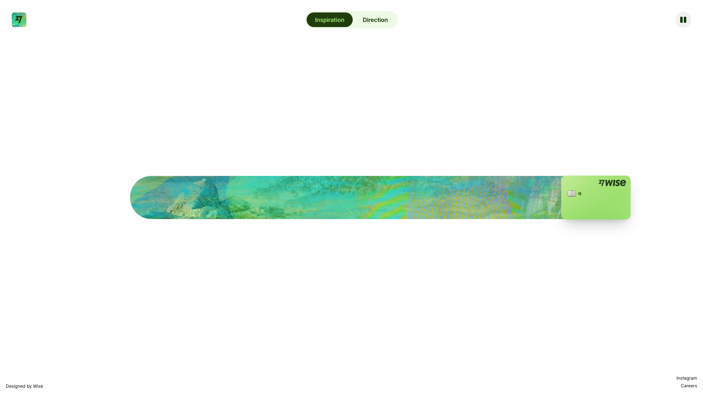
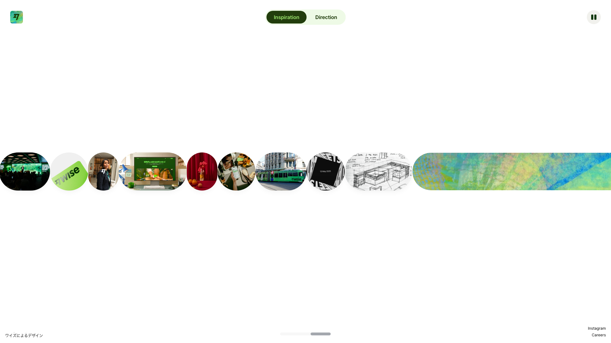

# Intro storyboard

**Source:** https://wise.design
**Detected:** hero-then-marquee (33ms → 1600ms)
**Frames:** 86 burst captures in `frames/`, 4 phase keyframes in `keyframes/`
**Engine:** GSAP no, Lenis no

## Phase keyframes (read in order)

### 0ms — empty

Chrome only — no visible media in carousel band

### 33ms — hero-focus

Single/few centered elements (largest 1920px, spread 0px)

### 1250ms — marquee-building

Marquee assembling (2 visible, spread 634px)

### 1600ms — marquee-full

Full marquee (33 visible, spread 972px)

## Dense flipbook
For motion between phases, scrub `frames/` — **33ms steps 0–1s**, 50ms 1–2.5s, 100ms after.
Suggested scrub: 0 → 33 → 66 → 132 → 330 → 660 → 990 → 1200 → 1450 → 1500 → 1650 → 1750ms